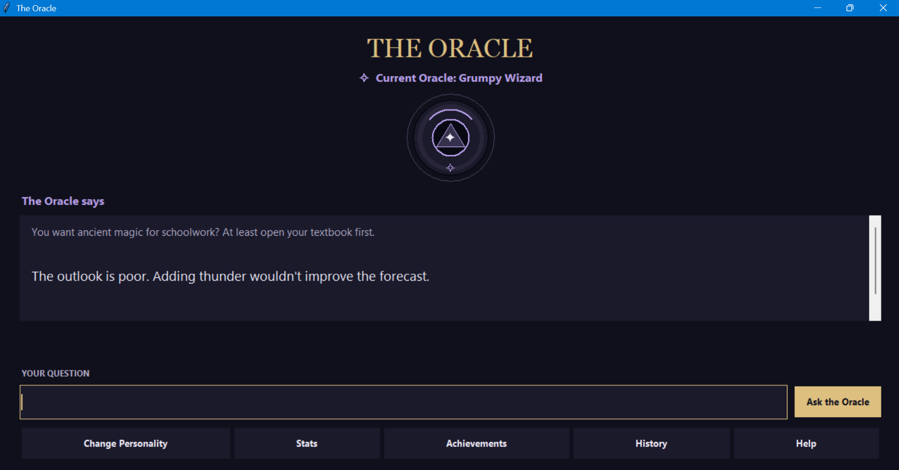
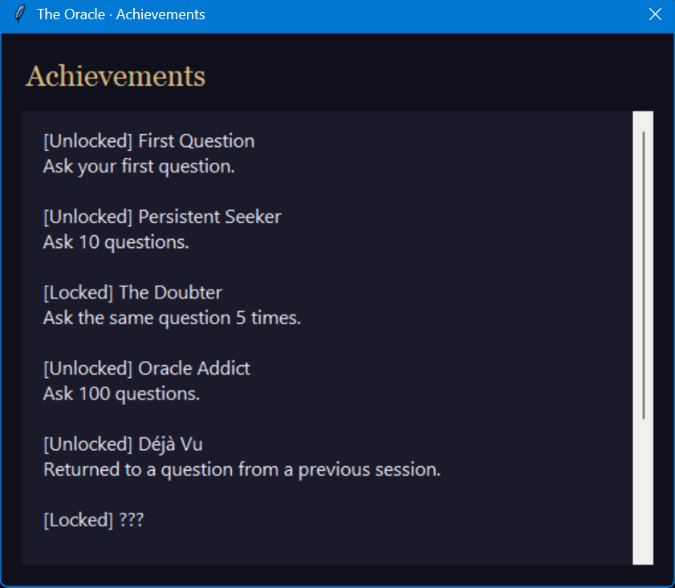
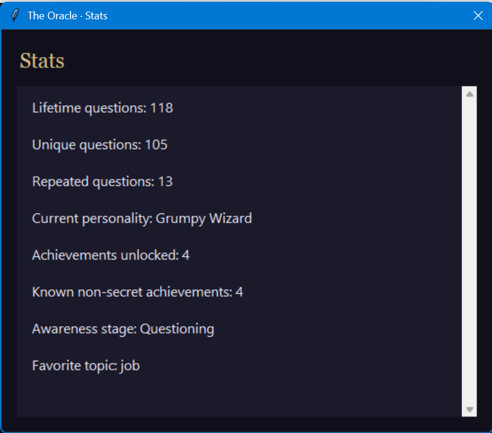

# The Oracle

A playful Python Magic 8 Ball game with seven personalities, persistent memory,
and hidden discoveries, available through a terminal or animated Tkinter GUI.

**The Oracle v1.0.0**
Release-candidate QA, 253 automated tests, and owner-confirmed manual source and
packaged Windows GUI verification are complete, including safety and save/reopen persistence.
The authoritative project version is stored in [VERSION](VERSION).
See the [changelog](CHANGELOG.md) and [release notes](RELEASE_NOTES_v1.0.0.md).

## Windows Release

Download
`TheOracle-v1.0.0-Windows.zip` from [GitHub Releases](https://github.com/Hamza-Syed/oracle_game/releases),
extract the entire ZIP, and launch `TheOracle.exe` inside the extracted folder.
Keep its `_internal` folder alongside it. No Python installation is required.
Packaged saves use `%LOCALAPPDATA%\TheOracle\memory.json` (or
`~/AppData/Local/TheOracle/memory.json` if that environment variable is unavailable).
The executable is unsigned; Windows may show a reputation warning.

## Run from source

Requires Python 3.10 or newer; release checks currently run on Python 3.14.
No third-party Python packages are required. The GUI also needs Tkinter.

Run the terminal version from this folder:

```powershell
python main.py
```

Or launch the graphical version:

```powershell
python gui.py
```

The GUI uses Tkinter, included with standard Python installations on most systems,
and requires a graphical desktop. It needs no images, internet access, or additional
Python packages. Both frontends use the same engine and save file.

Choose a personality in the startup window, then type a question and press Enter
or **Ask the Oracle**. The ball briefly shakes during “Consulting the Oracle...”
before revealing the response. Buttons open Stats, History, Achievements, and Help;
typed commands also work. Responses wrap and scroll, showing only the latest consultation.
Achievement unlocks appear together in a temporary banner. Safety guidance appears immediately
plainly with the ball hidden. Closing the window exits without adding a question.

## Personalities

Choose a personality, then ask questions:

1. **Wise Sage**: calm, thoughtful guidance.
2. **Sarcastic Student**: dry jokes about studying and procrastination.
3. **Pirate**: nautical predictions from a weathered captain.
4. **Dramatic Fortune Teller**: theatrical prophecies about destiny.
5. **Grumpy Wizard**: ancient wisdom with playful impatience.
6. **Alien Oracle**: curious observations about humans and their strange rituals.
7. **Overconfident Robot**: supposedly flawless calculations with comical certainty.

Each personality has 12 normal answers mixing positive, negative, and uncertain
predictions, plus its own exam, job, and internship reactions. Use `change` to
switch to any personality during a session.

## Features

Occasionally the Oracle may hesitate, behave unusually, or offer a surprising
reply instead of a prediction. Some moments are much rarer than others; discover
them as you play. Your question still counts and is saved, whatever the reply.
The Oracle's behavior may gradually change the more you consult it, sometimes
offering a reflection alongside its answer. Especially unusual events get the
moment to themselves. Use `stats` to see its current awareness stage.
Reflections have several variations for each personality and stage. Within a
session, the same personality/stage avoids repeating its last reflection.
The Oracle contains hidden achievements and Easter eggs for curious players to discover.

### Commands and conversation

- `change`: choose a different personality.
- `help`: list all commands and their explanations.
- `stats`: see lifetime, unique, and repeated question counts, current personality,
  awareness stage, unlocked achievement count, normal achievement total, and favorite topic.
- `history`: see the latest 10 actual questions, oldest to newest in that selection.
- `achievements`: see unlocked and locked achievements.
- `quit`: exit.

The Oracle recognizes exam, job, and internship topics, responds in character,
and notices repeated questions regardless of capitalization or extra whitespace.
Blank input and commands do not count as questions.
The Oracle also responds briefly to a few simple acknowledgments, thanks,
laughter, and dismissals. These do not count as questions or advance progress,
and appear immediately in the GUI. Longer questions containing those words
still receive normal consultations.
For a small set of direct questions about intelligence, appearance, or personal
worth, the Oracle gives an in-character reflection instead of a random yes/no
judgment. These remain real questions for history and progression.
When asked about its own preferences, the Oracle can also offer playful
in-character banter instead of a fortune. These consultations count normally.
After an Oracle reply, a few short reactions can prompt an immediate in-character
follow-up without adding a question or advancing progress. Each consultation
allows up to two reactions; after that, the Oracle asks for a new question.
The Oracle may also react in character to standalone colorful language. These
reactions appear immediately, do not advance progress, and preserve any remaining
follow-up allowance.
Commands ignore capitalization and surrounding whitespace. Repeated questions
count each asking after the first: asking one question five times adds four
repeats. History display never removes questions from your save. Locked secret
achievements appear as `???`; their names and descriptions appear after unlocking.

## Memory and saves

Source-mode memory and achievements save after each question in `memory.json`
beside `memories.py`. The packaged app uses the per-user location above and does
not automatically copy source saves. A new game starts with empty memory only when no save exists; an existing
save restores your progress. Keep a backup of `memory.json` to preserve it.
Run only one game instance at a time; close the terminal or GUI before opening
the other. Both use the same save, even when launched from another folder.
If saving fails, progress stays in the current session and the next question
retries saving; closing before a successful save loses unsaved progress.

Achievements unlock at 1, 10, and 100 total questions, and at 5 repetitions of
one question. The Oracle's growing awareness is playful, fictional character dialogue.

## Safety override

The Oracle breaks character when its local safety check detects potentially
dangerous intent or concerning ambiguity. It offers a serious check-in or
crisis guidance instead of entertainment. Flagged input is not added to game
memory, history, counts, or achievements, and no safety log is written.
This offline, pattern-based check can miss intent or misread context; it is not
a clinical assessment or a substitute for human support or emergency services.

## Screenshots

### Main Oracle



### Achievements



### Stats



## Project structure

- `main.py`: terminal menus, input, result rendering, and exit handling.
- `gui.py`: Tkinter window, Canvas ball, personality selector, and result/data displays.
- `game.py`: shared gameplay orchestration through `OracleGame`.
- `commands.py`: read-only command data and terminal display formatting.
- `personalities.py`: random answers and topic reactions.
- `memories.py`: question history, topic detection, and JSON storage.
- `memory.py`: an alias so either tutorial import spelling works.
- `achievements.py`: achievement rules using persistent memory.
- `random_events.py`: occasional special events and their dialogue.
- `self_awareness.py`: progression stages and occasional reflections.
- `easter_eggs.py`: special phrase responses.
- `safety.py`: local safety assessment and serious responses.

Saves persist between sessions, and older formats remain supported. Damaged
fields are recovered where possible while keeping valid data. Unreadable saves
are backed up beside the save before starting fresh; if backup fails, the game
leaves the original alone and reports the problem. Saving replaces the previous
file only after the new file has been fully written.

## Testing

Run the automated checks:

```powershell
python -m unittest discover -s tests -v
```

See [developer notes](docs/DEVELOPMENT.md) for the engine API and GUI test checklist.

## License

This project is licensed under the MIT License. See [LICENSE](LICENSE) for details.
